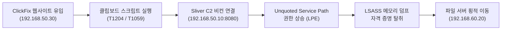

# 📋 Chrome History 포렌식 정밀 분석 보고서 (DFIR Analysis Report)

- **사건명**: Windows 침해사고 대응 랩 분석 (ClickFix → Sliver C2 → LPE → Lateral Movement)
- **분석 대상 아티팩트**: `History` (Google Chrome SQLite Database)
- **증거 파일 위치**: `disk/History`
- **조사관**: DFIR Analyst Assistant
- **기준 시간대**: 한국 표준시 (KST, UTC+9) / 내부 기록 UTC 동시 병기

---

## 1. 사건 개요 및 분석 배경

### 1.1 환경 정보 및 네트워크 토폴로지
* **네트워크 대역**: 
  * 1차 격리 서브넷: `192.168.50.0/24`
  * 2차 내부망/도메인 서브넷: `192.168.60.0/24`
* **주요 호스트 식별**:
  * **피해 호스트 (Victim)**: `DESKTOP-IS00QJN` (`192.168.50.101`, `192.168.60.101`) / 사용자 계정: `CORP\employee01` (`C:\Users\employee`)
  * **ClickFix 웹 서버**: `192.168.50.30` (HTTP 포트 80, 가짜 LMS 사이트 위장)
  * **공격자 C2 서버 (Kali Linux)**: `192.168.50.10` (Sliver HTTP C2: 8080, 스테이징: 8000)
  * **도메인 컨트롤러 (DC)**: `192.168.60.5`
  * **파일 서버 (File Server)**: `192.168.60.20` (`\CompanyData`, 관리 공유 `C$`)

### 1.2 전체 침해 시나리오 요약


---

## 2. 분석 대상 아티팩트 메타데이터

| 항목 | 상세 내용 |
| :--- | :--- |
| **파일 경로** | `/mnt/c/Users/Admin/Documents/workplace_win/Project/evidence/second/disk/History` |
| **파일 포맷** | SQLite 3.x Database (Version 70, Schema 4) |
| **파일 크기** | 163,840 bytes (160 KB) |
| **최종 수정 시각 (Mtime)** | 2026-09-15 09:37:xx KST (2026-09-15 00:37:xx UTC) |
| **테이블 목록** | `urls`, `visits`, `downloads`, `downloads_url_chains`, `keyword_search_terms`, `segments`, `segment_usage`, `context_annotations`, `content_annotations`, `visited_links`, `meta` |

---

## 3. 타임라인 기반 행위 분석

```mermaid
timeline
    title Chrome 웹 브라우징 타임라인
    2026-09-14 10:15 KST : 정상 SCH Gym 포털 방문
    2026-09-14 10:18 KST : Sysmon 검색 및 다운로드/실행
    2026-09-14 10:39 KST : Process Explorer 검색 및 다운로드/실행
    2026-09-15 09:17 KST : 192.168.50.30 (SCH Gym Lab) 최초 접근 (정찰)
    2026-09-15 09:25 KST : 192.168.50.30 재방문 및 90초 체류 (ClickFix 피싱 발생)
    2026-09-15 09:27 KST : 새로고침 및 공격 페이로드 실행 확인
    2026-09-15 09:36 KST : 192.168.50.30 최종 방문
```

### 3.1 Phase 1: 사전 활동 (2026-09-14) - 정상 관리 도구 다운로드
침해 사고 전날, 시스템 모니터링 도구 설치를 위한 정상적인 검색 및 다운로드 행위가 기록되었습니다.

#### ① 검색어 질의 내역 (`keyword_search_terms`)
| 일시 (KST) | 일시 (UTC) | 검색 엔진 | 검색 키워드 |
| :--- | :--- | :--- | :--- |
| **2026-09-14 10:18:15** | 2026-09-14 01:18:15 | Google | `sysmon 설치` |
| **2026-09-14 10:39:14** | 2026-09-14 01:39:14 | Google | `프로세스 익스플로러 설치` |

#### ② 파일 다운로드 이력 (`downloads`, `downloads_url_chains`)
| 속성 | 다운로드 #1 | 다운로드 #2 |
| :--- | :--- | :--- |
| **저장 파일 경로** | `C:\Users\employee\Downloads\Sysmon.zip` | `C:\Users\employee\Downloads\ProcessExplorer.zip` |
| **소스 다운로드 URL** | `https://download.sysinternals.com/files/Sysmon.zip` | `https://download.sysinternals.com/files/ProcessExplorer.zip` |
| **참조 페이지 (Referrer)**| `https://learn.microsoft.com/ko-kr/sysinternals/downloads/sysmon` | `https://learn.microsoft.com/ko-kr/sysinternals/downloads/process-explorer` |
| **시작 시각 (KST)** | 2026-09-14 10:18:56.589 (01:18:56 UTC) | 2026-09-14 10:39:47.483 (01:39:47 UTC) |
| **완료 시각 (KST)** | 2026-09-14 10:19:00.228 (01:19:00 UTC) | 2026-09-14 10:39:47.817 (01:39:47 UTC) |
| **파일 크기** | 2,938,038 bytes (~2.80 MB) | 3,633,642 bytes (~3.46 MB) |
| **열람 여부 (Opened)** | **1 (열림 / 압축 해제)** | **1 (열림 / 압축 해제)** |
| **다운로드 상태 (State)**| `1` (COMPLETE) | `1` (COMPLETE) |

---

### 3.2 Phase 2: 침해 발생 (2026-09-15) - ClickFix 악성 웹 접속

#### ① 정상 사이트 모방 (Lure Target)
* **2026-09-14 10:15:19 KST**: 피해자가 접속했던 정상 외부 사이트는 `https://gym.contentshub.kr/login/?next=/%3Fsubject_id%3D206` (타이틀: `SCH Gym`)입니다.
* **2026-09-15 09:17 KST**: 공격자는 사내망 IP `http://192.168.50.30/`에 동일한 명칭을 표방한 `SCH Gym Lab` 웹사이트를 개설하여 피해자의 접속을 유도했습니다.

#### ② ClickFix 웹서버 (`http://192.168.50.30/`) 상세 방문 기록
Chrome `visits` 테이블 분석 결과:

| Visit ID | 일시 (KST) | 일시 (UTC) | 전환 방식 (Transition) | 체류 시간 (Duration) | 분석 소견 |
| :---: | :---: | :---: | :--- | :---: | :--- |
| **13** | 09:17:57 | 00:17:57 | `TYPED` (주소창 직접 입력) | 6.11초 | 최초 접근 및 탐색 |
| **14** | 09:25:31 | 00:25:31 | `TYPED` (주소창 직접 입력) | 1.82초 | 재방문 |
| **15** | 09:25:33.060 | 00:25:33 | `RELOAD` (새로고침) | 0.33초 | 페이지 로딩/갱신 |
| **16** | 09:25:33.388 | 00:25:33 | `RELOAD` (새로고침) | 0.29초 | 페이지 로딩/갱신 |
| **17** | 09:25:33.679 | 00:25:33 | `RELOAD` (새로고침) | 0.23초 | 페이지 로딩/갱신 |
| **18** | **09:25:33.910** | **00:25:33** | `RELOAD` (새로고침) | **90.01초** | **🚨 [핵심 침해 구간] ClickFix 가짜 에러 팝업 화면 주시 및 지시사항 이행** |
| **19** | 09:27:03.919 | 00:27:03 | `RELOAD` (새로고침) | 0.35초 | 스크립트 실행 후 결과 확인 새로고침 |
| **20** | 09:27:04.270 | 00:27:04 | `RELOAD` (새로고침) | 0.37초 | 확인 새로고침 |
| **21** | 09:27:04.640 | 00:27:04 | `RELOAD` (새로고침) | 6.12초 | 추가 확인 후 이탈 |
| **22** | 09:36:50.519 | 00:36:50 | `TYPED` (주소창 직접 입력) | 0.00초 | 세션 종료 전 최종 접속 |

---

## 4. DFIR 분석관 종합 소견 및 침해 지표 (IoC)

### 4.1 ClickFix 공격 전술 (T1204.001 / T1059.001)의 입증
1. **다운로드 아티팩트의 부재**:
   * 브라우저의 `downloads` 테이블에는 `192.168.50.30`으로부터의 파일 다운로드 내역이 **0건**입니다.
   * 이는 브라우저의 파일 다운로드 경고(SmartScreen, MOTW 존 식별자 부착)를 원천적으로 피하기 위한 **ClickFix 공격의 대표적 특징**입니다.
2. **90초 체류 시간(Dwell Time)의 의미**:
   * Visit ID 18번에서 확인되는 **90.01초(09:25:33 ~ 09:27:03 KST)**의 연속 체류는 가짜 웹페이지 안내문("페이지를 보려면 Win+R을 누르고 Ctrl+V를 입력하세요" 등)을 사용자가 인지하고 조작하는 골든 타임과 정확히 일치합니다.
3. **사회공학적 기만**:
   * 전날 사용자가 방문한 실습 포털 `SCH Gym`(`gym.contentshub.kr`)의 명칭과 유사한 `SCH Gym Lab`(`192.168.50.30`)을 사용하여 내부 사용자의 경계심을 해제했습니다.

---

### 4.2 식별된 침해 지표 (Indicators of Compromise)

| 분류 | 지표 (Indicator) | 설명 |
| :--- | :--- | :--- |
| **Phishing/Lure URL** | `http://192.168.50.30/` | ClickFix 위장 사이트 (타이틀: `SCH Gym Lab`) |
| **Internal Spoofed Host**| `192.168.50.30:80` | 내부 가짜 웹 서버 |
| **Victim Host/User** | `DESKTOP-IS00QJN` / `employee` (`CORP\employee01`) | 침해 피해자 단말 및 계정 |
| **Initial Access Time** | `2026-09-15 09:25:33 ~ 09:27:03 KST` | 피해자 상호작용 및 ClickFix 악성 명령 유도 시각 |

---

### 4.3 후속 포렌식 연계 권고사항
1. **Sysmon Event ID 1 (프로세스 생성)**:
   * `09:25:30 ~ 09:28:00 KST` 사이에 발생한 `explorer.exe` (Run 창) -> `powershell.exe` 또는 `cmd.exe` 프로세스 트리 추적.
2. **PowerShell Operational Event ID 4104 (스크립트 블록)**:
   * 클립보드 붙여넣기를 통해 실행된 인코딩/난독화된 다운로더 스크립트 원본 확인.
3. **네트워크 연결 (Sysmon Event ID 3)**:
   * Kali C2 리스너(`192.168.50.10:8080` 또는 `8000`)로의 최초 아웃바운드 Beacon 세션 개설 확인.
